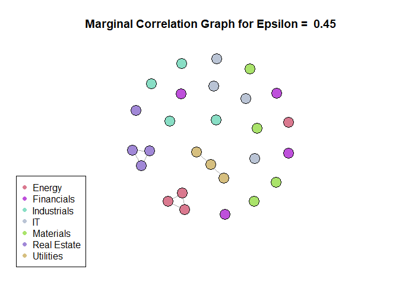
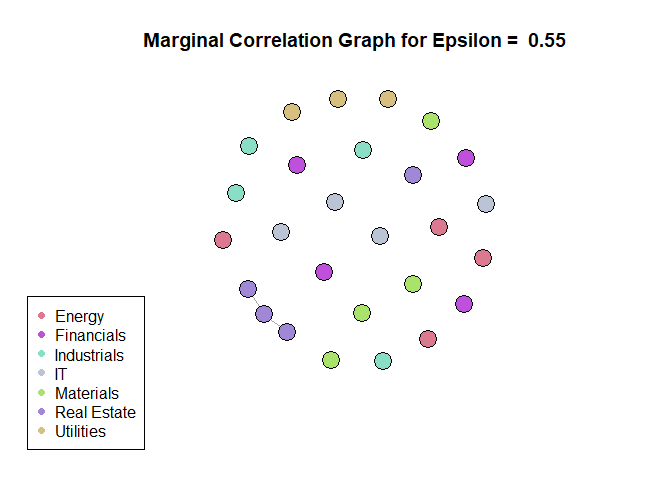
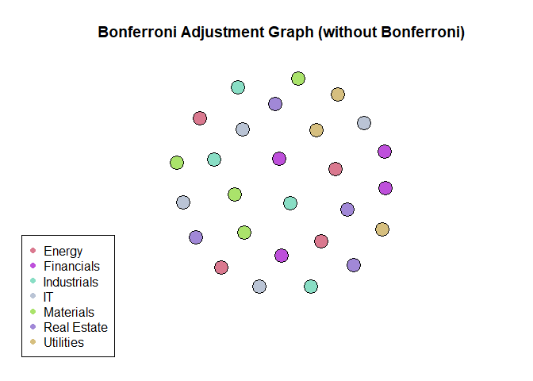
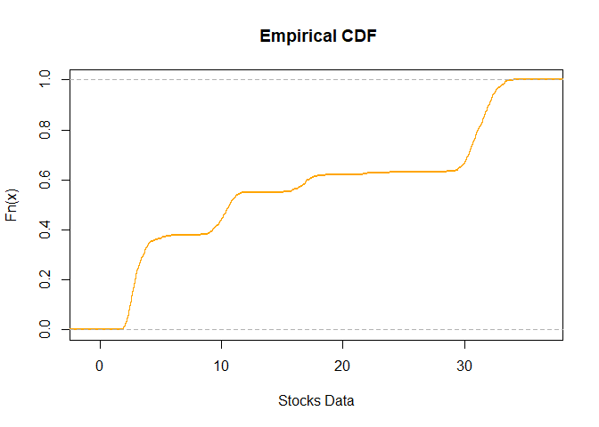
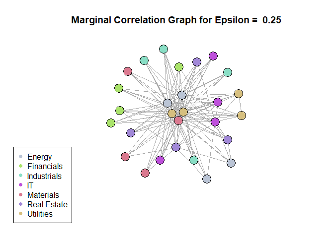
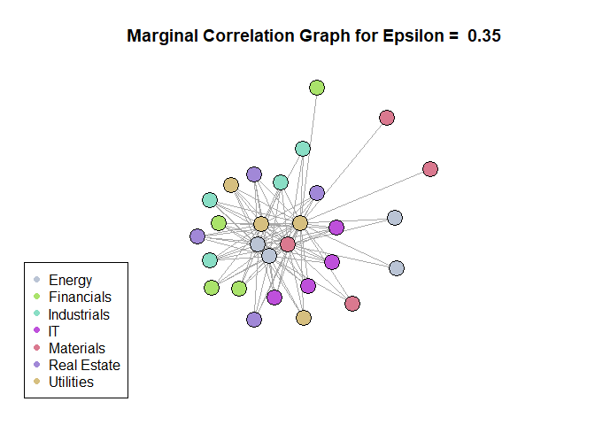
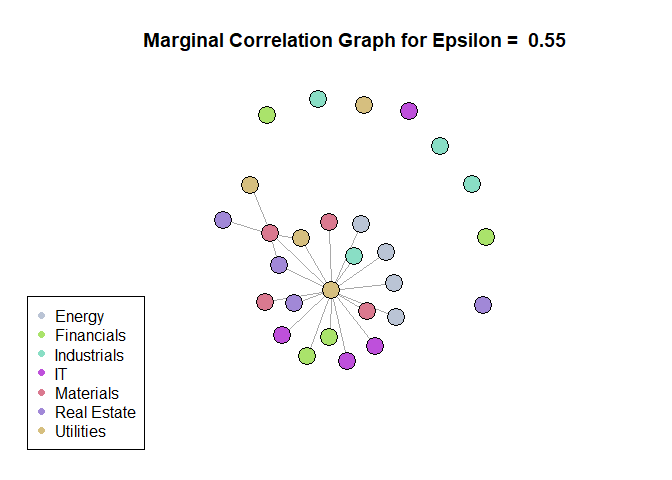
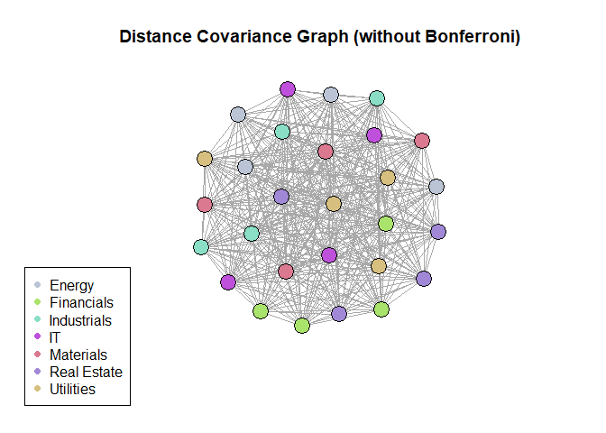
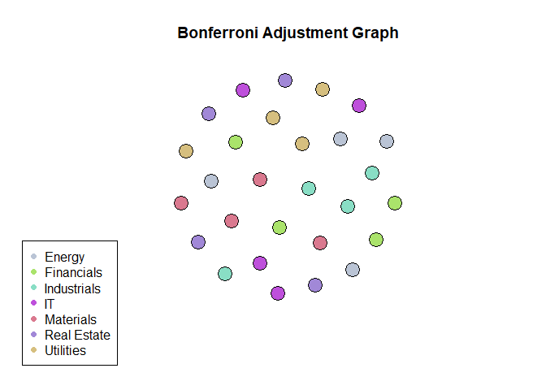

Stock, Dependency and Graphs
================
Joanna Broniarek and Guilherme Vescovi Nicchio
December 3, 2018

### **Goal: Study the dependency among stocks via Marginal Correlation Graphs**

Hypothesis: Stocks from the same GICS sectors should tend to be clustered together, since they tend to interact more with each other.

For studing the dependency among stocks, we collected the daily closing prices for 27 stocks in the S&P500 index which include the data from Janary 1, 2003 till today.

We decided to carry out the analysis for the following seven sectors:

``` r
GICS <- c("Energy", "Financials", "Industrials", 
          "Information Technology", "Materials", "Real Estate", "Utilities")
```

#### **Downloading data**

Data on stocks and symobols in the form of csv table were downloaded from: <https://en.wikipedia.org/wiki/List_of_S%26P_500_companies>. Then, we converted data into the 'Date' type and selected the dataset of stocks from 1 January 2003 on.

``` r
all.stocks <- read.csv(file="table-1.csv",  stringsAsFactors = FALSE)
all.stocks = mutate(all.stocks, data_first= as.Date(Date.first.added.3..4., format= "%Y-%m-%d"))
indx = which(all.stocks$Date.first.added.3..4. >= 2003-01-01)
in.period.stocks <- all.stocks[indx, ]
```

#### **Selecting a sensible portfolio of stocks before the [Crisis of 2008](https://en.wikipedia.org/wiki/Subprime_mortgage_crisis)**

In order to build our portfolio of stocks we followed these steps for each sector:

-   Get only the stocks which belong to this sector
-   Try to collect data of 4 stocks from 1 Jan 2003 to 1 Jan, 2008.
-   If we have data for 1258 days (data frame of size 2516), save them to dataframe. The number of days 1258 was the most common through all stocks. It is worth to mention that the number of days do not represent all days in 5 years between January 2003 and January 2008. There are days for which there were no recordings for any stock.

After these procedure we collected data from 27 stocks.

    merged_stocks <- array(NA, dim = c(1258,0))

    for (sector in GICS){
      sector_stocks <- in.period.stocks[which(in.period.stocks$GICS.Sector == sector), ]
      counter = 1
      
      for (stock_symb in sector_stocks$Symbol) {
        if (counter <= 4 ){try(
          {stock <- suppressWarnings(get.hist.quote(instrument=stock_symb, 
                                                    start="2003-01-01", 
                                                    end="2008-01-01", 
                                                    quote= c("Open","Close"), 
                                                    provider="yahoo", drop=T))
          
          if (length(stock) == 2516){
            stock <- as.data.frame(stock$Close)
            colnames(stock) <- c(stock_symb)
            merged_stocks <- cbind(merged_stocks, stock)
            counter = counter + 1}
    })}}}

    write.csv(merged_stocks, file="merged_stocks.csv")

Note: When checking for the lenght 2516, besides being the most common length it is also the most complete. Despite there were days missing in the data, after checking consecutive stocks it was noticed that this pattern repeats for all of them so it is not a problem to merged it using cbind function.

#### **Building the data matrix X**

First step in the analysis was transforming the data frame into a numeric matrix and remove the first column with dates. In order to build a matrix **X** where each element corresponds to:
$$ x\_{t,j} = log(\\frac{c\_{t, j}}{c\_{t-1, j}}),$$
 we created two auxiliary matrices M1, M2 shifted one day in rows.

``` r
merged_stocks <- read.csv("merged_stocks.csv")
M <- as.matrix(sapply(merged_stocks, as.numeric))
M <- M[,-1]
M1 <- M[-1, ]
M2 <- M[-(nrow(M)), ]
X <- log(M1/M2)
```

#### **The implementation of the bootstrap procedure to build the marginal correlation graps**

Generate the Pearson Correlation Coefficient Matrix between stocks:

``` r
Cor_M <- cor(X)
```

Next, set the size of the bootstrap simulation and started sampling with the replacement the M matrices from the X matrix (log matrix defined on the previous step), saving all the results.

``` r
M <- 1000

corr.boot <- list()
n = nrow(X)
set.seed(123)

for (m in 1:M){
  X_sample <- X[sample(1:n, size = n, replace = T), ]
  Corr_sample <- cor(X_sample)
  corr.boot[[m]] <- (Corr_sample)
}
```

For each bootstrap sample *m* ∈ 1, ..., *M*, we defined a simultaneous test statistics:
$$ \\bigtriangleup\_m = \\sqrt{n} \* max\_{j,k} \\mid \\hat{R\_m^\*}\[j,k\] - \\hat{R}\[j, k\]\\mid ,$$

``` r
delta_vec <- rep(NA, M)
n <- nrow(X)
for (m in 1:M)  delta_vec[m] <- sqrt(n) * max(abs(corr.boot[[m]] - Cor_M))
```

and its Empirical CDF. For n and M large enough, the ECDF( $\\hat F\_n$) is a good estimation of the True CDF (*F*<sub>*n*</sub>).

``` r
F_hat <- ecdf(delta_vec)
plot(F_hat, main=" Empirical CDF", col = "orange", xlab = "Stocks Data", cex = 0.25, lwd = 2)
```


In the next step, it was built the simultaneous confidence set at level 1 - *α*, where *α* = 0.05. Then, we calculated the value of
$$t\_{\\alpha} = \\hat{F}\_n^{-1}(1-\\alpha),$$
 and build the confidence set
$$ C\_{j, k}(\\alpha) = \[\\hat{R}\[j,k\]\\pm \\frac{t\_{\\alpha}}{\\sqrt{n}}\].$$

``` r
alpha <- 0.05
t_alpha <- quantile(delta_vec, c(1-alpha))
Conf_set <- list( Cor_M - (t_alpha/sqrt(n)), Cor_M + (t_alpha/sqrt(n)))
```

#### **Building Correlation Marginal Graphs**

The function **build\_edges** builds and returns the graph according to the distance matrix and epsilon value.

``` r
build_edges <- function(epsilon, Conf_set){
  #creating a matrix of of ones
  ones_mat <- matrix(1, nrow = ncol(X), ncol = ncol(X))
  
  #multiply the matrix of ones to the boolean matrix where the epsilon and the confidence sets have intersection
  boolean_mat <- as.matrix(ones_mat * 
                              (((Conf_set[[1]] > -epsilon) & (Conf_set[[1]] < epsilon)) 
                            |
                              ((Conf_set[[2]] > -epsilon) & (Conf_set[[2]] < epsilon)))
                            )
  #Swap zeros and ones as the output is inverted to what we want
  boolean_mat <- abs(boolean_mat-1)
  g <- make_undirected_graph(c(), n = ncol(X)) #a graph with no edges
  
  #go through the boolean matrix and place an edge at g if we find a 1
  for (i in 2:ncol(X)){
    for (k in 1:(i-1)) if (boolean_mat[i,k] == 1) g = add.edges(g,c(i,k)) }
return(g)}
```

Then, color the nodes/stocks according to theirs GICS sector.

``` r
color_vector = distinctColorPalette(k = 7)

# During saving and reading data from file the name for "BRK.B" changed to "BRK-B", so we used "if-else" for this case
sector_vector <- unlist(lapply(colnames(X), function(i) {
  if(i=="BRK.B") return("Financials") 
  else all.stocks$GICS.Sector[all.stocks$Symbol == i]  }))
# Creating the vector with colors for each node
sector_colors_vector <- unlist(lapply(1:ncol(X), function(i) {color_vector[which(GICS == sector_vector[i])]}))

legend_vector <- c("Energy", "Financials", "Industrials", 
          "IT", "Materials", "Real Estate", "Utilities")
```

In order to plot different graphs, it was created the function with all options already set.

``` r
plot_MC_graph <- function(epsilon, dist_matrix){
  graph1 <- build_edges(epsilon=epsilon, Conf_set=dist_matrix)
  
  plot(graph1, vertex.color = sector_colors_vector, vertex.size = 14, vertex.label = NA, 
       layout = layout_nicely, main=paste("Marginal Correlation Graph for Epsilon = ", toString(epsilon)))
  
  # add legend
  legend_vector <- c("Energy", "Financials", "Industrials", 
          "IT", "Materials", "Real Estate", "Utilities")
  legend(x=-2.5, y=-0.5, legend = legend_vector, pch = 19, col = color_vector)}
```

To check the dynamic of the graph according to the epsilon, it was tested some values, their graphs are displayed in the following plots.

Note: In all graphs in this project the stocks names were not displayed, as we don't want to pay attention to particular stocks but for how the **sectors** are correlated.

``` r
plot_MC_graph(epsilon = 0.15, dist_matrix = Conf_set)
```


``` r
plot_MC_graph(epsilon = 0.25, dist_matrix = Conf_set)
```


``` r
plot_MC_graph(epsilon = 0.30, dist_matrix = Conf_set)
```


``` r
plot_MC_graph(epsilon = 0.35, dist_matrix = Conf_set)
```


``` r
plot_MC_graph(epsilon = 0.45, dist_matrix = Conf_set)
```



``` r
plot_MC_graph(epsilon = 0.55, dist_matrix = Conf_set)
```



It is possible to notice that stocks from the Energy, Utitlies and Real Estate sectors tend to be clustered even for high values of epsilon, which means their stock prices are strongly correlated (for significance level of alpha = 5%).

Real estate is a special instance of real property, it includes land, buildings and other improvements - plus the rights of use and enjoyment of that land and all its improvements. This sector was very impacted by [The Fall of the Market in the Fall of 2008](https://www.investopedia.com/articles/economics/09/subprime-market-2008.asp).

The energy sector is a large and describes a network of companies directly and indirectly involved in the production and distribution of energy needed to power the economy and facilitate the means of production and transportation. Performance in this sector is mostly driven by the supply and demand for worldwide energy. Oil and gas producers will do very well during times of high oil and gas prices, but will earn less when the value of the commodity drops. On further studies it would be meaningful to observe the dependency of the stocks and the oil price, which might be the main reason behind the correlation between energy stocks.

The utilities sector is a category of stocks for utilities such as gas and power. The sector contains companies such as electric, gas and water firms, and integrated providers. Because utilities require significant infrastructure, these firms often carry large amounts of debt; with a high debt load, utilities companies become sensitive to changes in the interest rate. For example, in 2015, the U.S. Environmental Protection Agency (EPA) proposed a plan for lowering carbon pollution from domestic power plants by 30% from 2005 levels by 2030. Electric utilities relying mostly on coal and without appropriate retrofit for scaling down their carbon footprint would be the most affected. DTE Energy management estimated needing $15 billion to upgrade energy infrastructure to match the EPA's required environmental standards. The company would need to invest approximately 7 to 8 billion dollars to meet the energy policy's standards.

Read more about Stock prices and Sectors at <https://www.investopedia.com>.

### Graph based on Distance Covarianve and Hypothesis testing.

**Philosophy of a Statistical Test** The main idea of the hypothesis testing is based on a null hypothesis, that all stocks are independent of each other .

Let's call *H*<sub>0</sub> the null hypothesis. The Stock *i* and Stock *j* under analysis are independent.

The target is to decide *H*<sub>0</sub> to be rejected or not based on empirical evidence.

For testing the correlation between stock we will use a nonparametric measure of association called **distance covariance**, denoted by:

*γ*<sup>2</sup>(*X*, *Y*)=*E*\[*δ*(*X*, *X*′) ⋅ *δ*(*Y*, *Y*′)\]
 Where (*X*, *Y*) and (*X*′,*Y*′) are independent copies, and from it we have that:

$$\\rho^2(X,Y) = \\frac{\\gamma^2(X,Y)}{\\sqrt{\\gamma^2(X,X)\\gamma^2(Y,Y)}}$$

Thus, *ρ*(*X*, *Y*)∈\[0, 1\] and *ρ*(*X*, *Y*)=0 ⇔ *X*⊥*Y*.

It will be performed a multiple hypothesis testing (with and without Bonferroni correction) placing an edge {i, j} between stock i and stock j if and only if we reject the null hypothesis that *γ*<sub>*j*, *k*</sub><sup>2</sup> = 0.

For this it will be used the package energy to perform those tests.

The function dcov.test() can perform multiple tests and return the p-value, which is the smallest *α* in which the test rejects the null Hypothesis. Informally, the p-value is a measure of evidence against *H*<sub>0</sub>. The smaller the p-value the stronger the evidence against it.

#### Building the Distance Covariance Matrix

The dcov.test() function uses the following parameters:

-   x: data or distances of first sample
-   y: data or distances of second sample
-   R: number of replicates
-   index: exponent on Euclidean distance, in (0,2\]

Where the x and y are stock i and j, the value of R equal to 200 and index 0.001 have demonstrated a good output for this test.

``` r
# empty matrix
distance_cov_matrix <- matrix(0, nrow = ncol(X), ncol = ncol(X), dimnames = dimnames(X))

# fill empty matrix lower diagonal section with the p-value from the distance covariance function between stocks i and j from X
for (i in 1:nrow(distance_cov_matrix)) {
  for (j in 1:i) distance_cov_matrix[i,j] = dcov.test(X[,i], X[,j], R= 200, index = 0.001)$p.value}
```

The null hypothesis *H*<sub>0</sub> is that Stock *i* and Stock *j* are independent. More generally we can interpret the p-value as follow:

-   p-value &lt; 0.01 - very strong evidence against *H*<sub>0</sub>.
-   p-value in \[0.01, 0.05\] - strong evidence against *H*<sub>0</sub>.
-   p-value in \[0.05, 0.1\] - weak evidence against *H*<sub>0</sub>.
-   p-value &gt; 0.1 - little or no evidence against *H*<sub>0</sub>.

Accordingly to the p-value threshold of 0.01, let's place an edge on the Covariance Distance Matrix where p-values smaller than 0.01 will be considered as edges, meaning that they are not independent.

``` r
g2 <- make_undirected_graph(c(), n = ncol(X)) #a graph with no edges
  
  # go through the covariance matrix and place an edge at g2 if pvalue is smaller than 0.01
for (i in 2:ncol(X)){
  for (k in 1:(i-1)) if (distance_cov_matrix[i,k] < 0.01) g2 = add.edges(g2,c(i,k)) }
```

**Plotting the results**

``` r
plot(g2, vertex.color = sector_colors_vector, vertex.size = 14, vertex.label = NA, 
       layout = layout_nicely, main=paste("Distance Covariance Graph"))

legend(x=-2.5, y=-0.5, legend = legend_vector, pch = 19, col = color_vector)
```


It is possible to notice that the Hypothesis Test is quite liberal to show correlation between stocks. Therefore, we want to be more conservative with false positive statements regarding the correlation between stocks. The easiest way to control the family-wise error rate at level *α* is the Bonferroni method.

The decision rule based on this method is:

**Reject** *H*<sub>0</sub><sup>(*k*)</sup> if $p^{(k)} &lt; t\_{bon} = \\frac{\\alpha}{m}$,

where the *m* parameter is the number of possible combinations between stocks.

Performing the Bonferroni Correction.

``` r
pval_length <- choose(ncol(X), 2)
alpha <- 0.05

t_bonf <- alpha/pval_length

#building the adjusted matrix
adj_matrix <- matrix(0, nrow = ncol(X), ncol = ncol(X), dimnames = dimnames(X))
adj_matrix[which(distance_cov_matrix < t_bonf)] <- 1
```

**Plotting the results**

``` r
graph3 <- make_undirected_graph(c(), n = ncol(X)) #a graph with no edges
  
#go through the adjusted matrix value and add an edge at graph 3 if the value if adj_matrix[i,k] == 1
for (i in 2:ncol(X)){
  for (k in 1:(i-1)) if (adj_matrix[i,k] == 1) graph3 = add.edges(graph3,c(i,k))
}

plot(graph3, vertex.color = sector_colors_vector, vertex.size = 14, vertex.label = NA, 
       layout = layout_nicely, main="Bonferroni Adjustment Graph (without Bonferroni)")

legend(x=-2.5, y=-0.5, legend = legend_vector, pch = 19, col = color_vector)
```



Repeating the analysis for a different time interval
====================================================

Now that was analysed how the stocks behave before the [Crisis of 2008](https://en.wikipedia.org/wiki/Subprime_mortgage_crisis) let's analyse for the period after the effects of the crisis were "already attenuated", from January 2013 to January 2018.

**Downloading the data**

    merged_stocks_2 <- array(NA, dim = c(2518,0))

    for (sector in GICS){
      sector_stocks <- in.period.stocks[which(in.period.stocks$GICS.Sector == sector), ]
      counter = 1
      
      for (stock_symb in sector_stocks$Symbol) {
        if (counter <= 4 ){try(
          {stock <- suppressWarnings(get.hist.quote(instrument=stock_symb, 
                                                    start="2013-01-01", 
                                                    end="2018-01-01", 
                                                    quote= c("Open","Close"), 
                                                    provider="yahoo", drop=T))
          
          print(length(stock))
          if (length(stock) == 2518){
            stock <- as.data.frame(stock$Close)
            colnames(stock) <- c(stock_symb)
            merged_stocks_2 <- cbind(merged_stocks_2, stock)
            counter = counter + 1
            print(counter)}
    })}}}

    write.csv(merged_stocks_2, file="merged_stocks_2.csv")

#### Repeating the previous proccess

``` r
merged_stocks_2 <- read.csv("merged_stocks_2.csv")
M <- as.matrix(sapply(merged_stocks_2, as.numeric))
M <- M[,-1]
M1 <- M[-1, ]
M2 <- M[-(nrow(M)), ]
X <- log(M1/M2)

# The bootstrap procedure to build the marginal correlation graps
Cor_M <- cor(X)
M <- 1000
corr.boot <- list()
n = nrow(X)
set.seed(123)

for (m in 1:M){
X_sample <- X[sample(1:n, size = n, replace = T), ]
Corr_sample <- cor(X_sample)
corr.boot[[m]] <- (Corr_sample)
}


# > Building delta vector and ECDF 
delta_vec <- rep(NA, M)
n <- nrow(X)
for (m in 1:M)  delta_vec[m] <- sqrt(n) * max(abs(corr.boot[[m]] - Cor_M))

F_hat <- ecdf(delta_vec)
plot(F_hat, main=" Empirical CDF", col = "orange", xlab = "Stocks Data", cex = 0.25, lwd = 2) 
```



``` r
# > Calculating confidence sets
alpha <- 0.05
t_alpha <- quantile(delta_vec, c(1-alpha))
Conf_set <- list( Cor_M - (t_alpha/sqrt(n)), Cor_M + (t_alpha/sqrt(n)))
```

Coloring stocks.

``` r
color_vector = distinctColorPalette(k = 7)

# During saving and reading data from file the name for "BRK.B" changed to "BRK-B", so we used "if-else" for this case
sector_vector <- unlist(lapply(colnames(X), function(i) {
  if(i=="BRK.B") return("Financials") 
  else all.stocks$GICS.Sector[all.stocks$Symbol == i]  }))
# Creating the vector with colors for each node
sector_colors_vector <- unlist(lapply(1:ncol(X), function(i) {color_vector[which(GICS == sector_vector[i])]}))

legend_vector <- c("Energy", "Financials", "Industrials", 
          "IT", "Materials", "Real Estate", "Utilities")
```

#### **Building Correlation Marginal Graphs**

To check the dynamic of the graph according to the epsilon, it was tested some values, their graphs are displayed in the following plots.

``` r
plot_MC_graph(epsilon = 0.25, dist_matrix = Conf_set)
```



``` r
plot_MC_graph(epsilon = 0.35, dist_matrix = Conf_set)
```



``` r
plot_MC_graph(epsilon = 0.45, dist_matrix = Conf_set)
```


``` r
plot_MC_graph(epsilon = 0.55, dist_matrix = Conf_set)
```



``` r
plot_MC_graph(epsilon = 0.60, dist_matrix = Conf_set)
```


``` r
plot_MC_graph(epsilon = 0.65, dist_matrix = Conf_set)
```


#### **Building The Disctance Covariance Matrix**

``` r
distance_cov_matrix <- matrix(0, nrow = ncol(X), ncol = ncol(X), dimnames = dimnames(X))
for (i in 1:nrow(distance_cov_matrix)) {
  for (j in 1:i) distance_cov_matrix[i,j] = dcov.test(X[,i], X[,j], R= 200, index = 0.001)$p.value }
```

``` r
g2 <- make_undirected_graph(c(), n = ncol(X)) #a graph with no edges
for (i in 2:ncol(X)){
  for (k in 1:(i-1)) if (distance_cov_matrix[i,k] < 0.01) g2 = add.edges(g2,c(i,k)) }
```

Distance Covarianve Graph without Bonferroni Correction:

``` r
plot(g2, vertex.color = sector_colors_vector, vertex.size = 14, vertex.label = NA, 
     layout = layout_nicely, main=paste("Distance Covariance Graph (without Bonferroni)"))
legend(x=-2.5, y=-0.5, legend = legend_vector, pch = 19, col = color_vector)
```



Bonferroni Adjustment Graph:

``` r
pval_length <- choose(ncol(X), 2)
alpha <- 0.05
t_bonf <- alpha/pval_length

adj_matrix <- matrix(0, nrow = ncol(X), ncol = ncol(X), dimnames = dimnames(X))
adj_matrix[which(distance_cov_matrix < t_bonf)] <- 1

# > Plotting the results with Bonferroni Correction
graph3 <- make_undirected_graph(c(), n = ncol(X)) #a graph with no edges
for (i in 2:ncol(X)){
  for (k in 1:(i-1)) if (adj_matrix[i,k] == 1) graph3 = add.edges(graph3,c(i,k))}

plot(graph3, vertex.color = sector_colors_vector, vertex.size = 14, vertex.label = NA, 
     layout = layout_nicely, main="Bonferroni Adjustment Graph")
legend(x=-2.5, y=-0.5, legend = legend_vector, pch = 19, col = color_vector)
```



It is noticeble that Confidence Intervals have more reasonable results than Hypothesis Testing. Hypothesis tests are susceptible to false positive statements, or false discoveries (type 1 error). As we can see in the Distance Covariance Graph withouth Bonferroni Correction most of the stocks are correlated according to the test.

As it is very undesired we must be very strict with error control and applying the Bonferroni adjustment we don't see any correlation between any stocks, which reassures our null Hypothesis but don't lead our study further.

It is reasonable to choose Confidence Intervals as analysis tool in contrast to Hypothesis Testing as it provides more tangible results.

Furthermore, it is worth to remark that correlation doesn't always mean causality and we can't assure that a stock is dependent on another withouth further studies in the topic.
